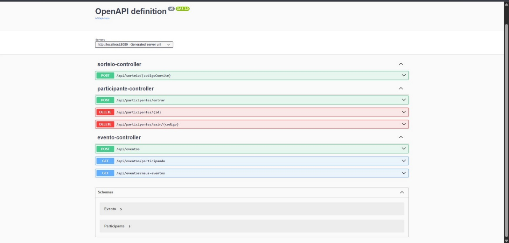

# 🎁 Secret Friend API (Amigo Secreto com IA)

Esta é uma API REST robusta desenvolvida com **Spring Boot** para gerir eventos de Amigo Secreto. O sistema automatiza todo o processo, desde o registo de participantes até o sorteio final, integrando **Inteligência Artificial** para sugerir presentes e enviando os resultados por e-mail de forma assíncrona.

## 🔗 Evolução do Projeto

* **26 de Dezembro de 2025:** Publicação inicial do projeto focado em persistência de dados e serviços automatizados.
* **11 de Janeiro de 2026:** Implementação de **Códigos de Convite** (UUID). O sistema passou a utilizar identificadores únicos para entrada nos eventos, aumentando a segurança.
* **12 de Janeiro de 2026:** Criação da estrutura de controle administrativo.
* **17 de Janeiro de 2026 (Manhã):** Implementação de **Spring Security** e **OAuth2**. A autenticação administrativa agora é feita via Login com Google, eliminando senhas manuais.
* **17 de Janeiro de 2026 (Noite):** Migração do banco de dados de MySQL para **PostgreSQL** e refinamento da containerização Docker para maior portabilidade.

## ✨ Funcionalidades

* **Gestão de Eventos:** Criação de eventos com nome, e-mail do organizador e data do sorteio.
* **Autenticação OAuth2:** Login seguro via Google para organizadores. O acesso às funcionalidades administrativas (como realizar o sorteio) é protegido.
* **Entrada via Código de Convite:** Para entrar no evento, o participante deve utilizar um código único (ex: `AE7697`), protegendo os IDs sequenciais do banco.
* **Proteção de Rotas:** Utilização do Spring Security para blindar endpoints críticos, permitindo acesso público apenas onde necessário.
* **Sorteio Inteligente:** Lógica circular que garante que ninguém se sorteia a si mesmo, realizada dentro de uma transação segura (`@Transactional`).
* **Sugestões por IA:** Integração com o modelo `llama-3.1-8b-instant` da Groq para gerar 3 sugestões de presentes baseadas nos gostos do sorteado.
* **Notificações por E-mail:** Envio automático do resultado do sorteio e das sugestões da IA.
* **Processamento Assíncrono:** Uso de threads em background para que o envio de e-mails e chamadas de IA não bloqueiem a API.
* **Infraestrutura Docker:** Orquestração completa do ambiente (API + Banco PostgreSQL) utilizando containers.

## 🛠️ Principais Tecnologias Utilizadas

* **Java 17** e **Spring Boot 4**
* **Spring Security & OAuth2 Client:** Autenticação e controle de acesso via Google.
* **Spring Data JPA:** Persistência de dados.
* **PostgreSQL:** Banco de dados relacional robusto (anteriormente MySQL).
* **Docker & Docker Compose:** Containerização e orquestração.
* **Groq Cloud API:** Processamento de linguagem natural (IA).
* **Java Mail Sender:** Envio de e-mails via SMTP.
* **Jackson:** Serialização de objetos e controle de JSON.

## 🚀 Como Executar (Via Docker)

Esta é a forma recomendada de rodar o projeto. O Docker Compose subirá automaticamente a API e o banco de dados PostgreSQL configurado.

1. Crie um arquivo **`.env`** na raiz do projeto com as suas credenciais:
```env
EMAIL_USER=seu_email@gmail.com
EMAIL_PASS=sua_senha_app
GROQ_KEY=sua_chave_groq
GOOGLE_CLIENT_ID=seu_client_id_google
GOOGLE_CLIENT_SECRET=seu_client_secret_google

```

2. Execute o comando:

```bash
docker compose up --build

```

A API estará disponível em `http://localhost:8080`.

## 📌 Endpoints Principais

### 1. Organização (Protegido)

* **`POST /api/eventos`**
* **Função:** Cria um novo evento (Requer autenticação via Token/Sessão).
* **Body:** JSON com `nomeEvento`, `email` e `dataSorteio`.
* **Retorno:** O Objeto Evento contendo o **Código de Convite**.

### 2. Participação (Público)

* **`POST /api/participantes/entrar?codigo={codigoConvite}`**
* **Função:** Registra um participante no evento.
* **Query Param:** O código do evento (ex: `?codigo=AE7697`).
* **Body:** JSON com `nome`, `email` e `gostosPessoais`.
* **`GET /api/participantes/{codigoConvite}`**
* **Função:** Consulta a lista pública de participantes de um evento específico.
* **Retorno:** Lista de nomes e status.

### 3. Ação Final (Protegido)

* **`POST /api/sorteio/{codigoConvite}`**
* **Função:** Realiza o sorteio e dispara os e-mails (Requer autenticação).
* **Regra:** Requer que o evento tenha no mínimo 2 participantes.

---

## 🎥 Demonstração
* **API em ação:** do cadastro no Postman até o e-mail enviado com sugestões da IA.


* **Spring Security e OAuth2**


* **Swagger UI:** A documentação interativa pode ser acessada em `http://localhost:8080/swagger-ui.html` (Necessário login para endpoints protegidos).

