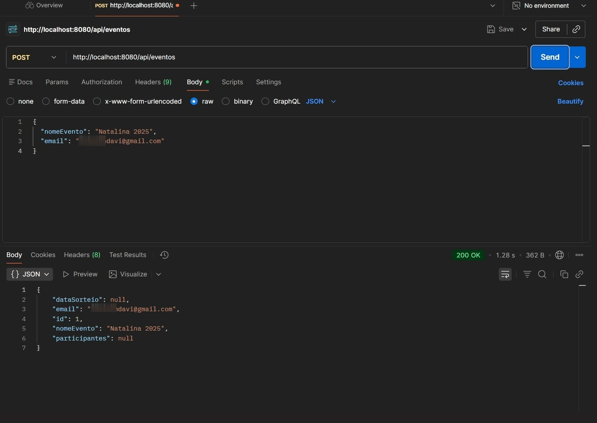
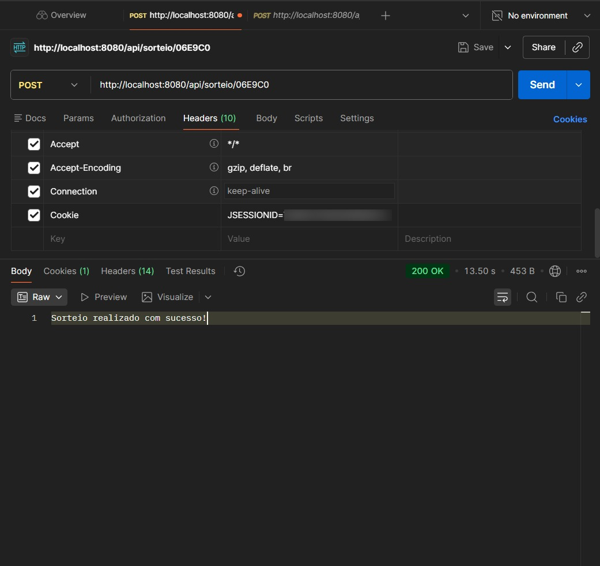

# 🎁 Secret Friend API (Amigo Secreto com IA)

Esta é uma API REST robusta desenvolvida com **Spring Boot** para gerir eventos de Amigo Secreto. O sistema automatiza todo o processo, desde o registo de participantes até o sorteio final, integrando **Inteligência Artificial** para sugerir presentes e enviando os resultados por e-mail de forma assíncrona.

## 🔗 Evolução do Projeto

* **26 de Dezembro de 2025:** Publicação inicial do projeto focado em persistência de dados e serviços automatizados.
* **11 de Janeiro de 2026:** Implementação de **Códigos de Convite** (UUID). O sistema passou a utilizar identificadores únicos para entrada nos eventos, aumentando a segurança ao deixar de expor os IDs sequenciais do banco de dados.
* **12 de Janeiro de 2026:** Criação da **Senha do Organizador** para controle administrativo básico.
* **17 de Janeiro de 2026:** Implementação de Segurança Avançada. Integração completa do **Spring Security** e **OAuth2**. Agora, a autenticação administrativa é feita via Login com Google, eliminando senhas manuais e garantindo proteção robusta aos endpoints sensíveis.

## ✨ Funcionalidades

* **Gestão de Eventos:** Criação de eventos com nome, e-mail do organizador e data do sorteio.
* **Autenticação OAuth2:** Login seguro via Google para organizadores. O acesso às funcionalidades administrativas (como realizar o sorteio) é protegido e requer um utilizador autenticado.
* **Entrada via Código de Convite:** Para entrar no evento, o participante deve utilizar um código único gerado automaticamente (ex: "AE7697"), garantindo que o ID do banco de dados não seja exposto.
* **Proteção de Rotas:** Utilização do Spring Security para blindar endpoints críticos, permitindo acesso público apenas onde necessário (como Swagger UI e registo de participantes).
* **Gestão de Participantes:** Registo de participantes vinculados ao evento exclusivamente através deste código de convite.
* **Sorteio Inteligente:** Lógica circular que garante que ninguém se sorteia a si mesmo, realizada dentro de uma transação segura.
* **Sugestões por IA:** Integração com o modelo `llama-3.1-8b-instant` da Groq para gerar 3 sugestões de presentes baseadas nos interesses de cada sorteado.
* **Notificações por E-mail:** Envio automático do resultado do sorteio e das sugestões da IA para cada participante.
* **Processamento Assíncrono:** Uso de execução em segundo plano para que o envio de e-mails e chamadas de IA não bloqueiem a resposta da API.
* **Infraestrutura Docker:** Orquestração completa do ambiente (API + Base de Dados MySQL) utilizando containers.

## 🛠️ Tecnologias Utilizadas

* **Java 17** e **Spring Boot 3**.
* **Spring Security & OAuth2 Client:** Para autenticação robusta e controlo de acesso via Google.
* **Spring Data JPA:** Para persistência em base de dados (MySQL).
* **UUID & @PrePersist:** Para geração dos códigos de convite.
* **Docker & Docker Compose:** Para garantir portabilidade e facilidade no setup.
* **Groq Cloud API:** Para processamento de linguagem natural e sugestões inteligentes.
* **Java Mail Sender:** Para comunicação via protocolo SMTP.
* **Jackson:** Para manipulação de JSON e controlo de referências cíclicas entre entidades.

## 🚀 Como Executar (Via Docker)

Esta é a forma mais simples de rodar o projeto, pois configura automaticamente a base de dados MySQL e a API sem necessidade de instalações complexas.

1. Crie um ficheiro **`.env`** na raiz do projeto com as suas chaves (este ficheiro é ignorado pelo Git). **Nota:** Agora é necessário incluir as credenciais do Google OAuth2:
```env
EMAIL_USER=seu_email@gmail.com
EMAIL_PASS=sua_senha_app
GROQ_KEY=sua_chave_groq
GOOGLE_CLIENT_ID=seu_client_id_google
GOOGLE_CLIENT_SECRET=seu_client_secret_google

```

2. Execute o comando:

```bash
docker compose up --build

```

A API estará disponível em `http://localhost:8080`. Para acessar a documentação e testar os endpoints protegidos, acesse o **Swagger UI** em `http://localhost:8080/swagger-ui.html` e faça o login com sua conta Google.

## 📌 Endpoints Principais

Todos os endpoints necessários para realizar o fluxo completo do Amigo Secreto:

### 1. Organização (Protegido)

* **`POST /api/eventos`**
* **Função:** Cria um novo evento (Requer autenticação).
* **Body:** JSON com `nomeEvento`, `email` e `dataSorteio`.
* **Retorno:** O Objeto Evento contendo o **Código de Convite** (UUID).


### 2. Participação (Público)

* **`POST /api/participantes/entrar?codigo={codigoConvite}`**
* **Função:** Registra um participante no evento.
* **Query Param:** O código do evento (ex: `?codigo=AE7697`).
* **Body:** JSON com `nome`, `email` e `gostosPessoais`.


* **`GET /api/participantes/{codigoConvite}`**
* **Função:** Consulta a lista pública de participantes (usado para atualizar a tela).
* **Retorno:** Array JSON com os dados dos participantes.


### 3. Ação Final (Protegido)

* **`POST /api/sorteio/{codigoConvite}`**
* **Função:** Realiza o sorteio e dispara os e-mails (Requer autenticação).
* **Regra:** Requer que o evento tenha no mínimo 2 participantes.
* **Retorno:** Mensagem de sucesso ou erro.


---

## 🎥 Demonstração

Veja a API em ação: do cadastro no Postman até o e-mail enviado com sugestões da IA.


Spring Security e OAuth2

