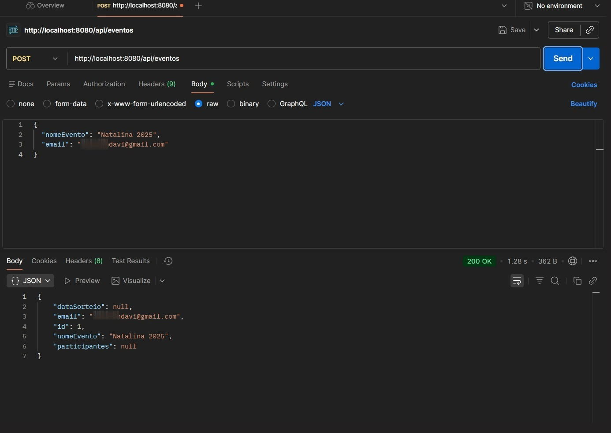
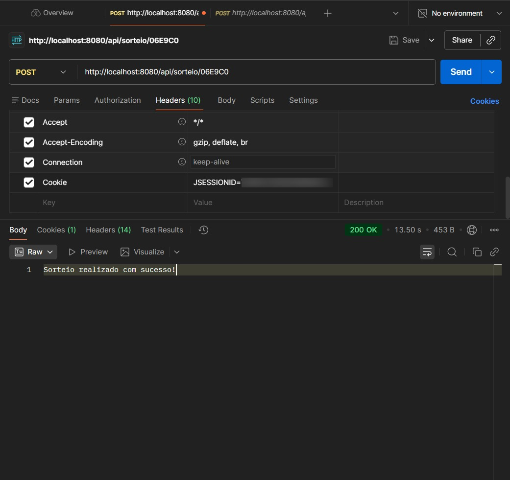
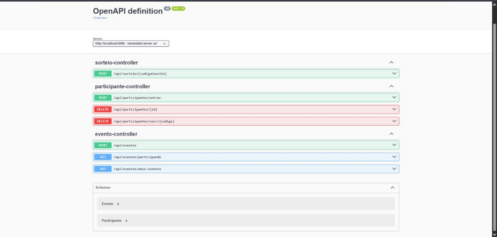

# 🎁 Secret Friend IA (Amigo Secreto Fullstack)

[](https://github.com/dvx0exe/secret-friend-api/actions/workflows/maven-ci.yml)
[](https://api-amigo-secreto.onrender.com/swagger-ui/index.html)

🇧🇷 [Português](#-sobre-o-projeto) | 🇺🇸 [English](#-about-the-project)

---

## 🇧🇷 Sobre o Projeto

Esta é uma solução **Fullstack** robusta desenvolvida com **Java 17 e Spring Boot** para gerir eventos de Amigo Secreto. O sistema automatiza todo o processo, desde o registro de participantes até o sorteio final, integrando **Inteligência Artificial** para sugerir presentes e enviando os resultados por e-mail de forma assíncrona.

---

## 🔗 Evolução do Projeto

* **23 de Dezembro de 2025:** Publicação inicial focada em persistência de dados e serviços básicos.
* **11 de Janeiro de 2026:** Implementação de **UUIDs** para convites seguros e proteção de IDs.
* **17 de Janeiro de 2026:** Camada de segurança com **Spring Security** e **OAuth2** (Login com Google).
* **22 de Janeiro de 2026:** Interface **SPA (Vanilla JS)** artesanal e deploy na infraestrutura **Render**.
* **11 de Março de 2026:** Implementação de **Testes Unitários** e lógica de **Resiliência de IA**.

---

## ✨ Funcionalidades

* **Dashboard SPA:** Gerenciamento dinâmico de eventos (Organizador vs. Participante).
* **Autenticação OAuth2:** Acesso administrativo blindado via Login com Google.
* **Sorteio com IA Resiliente:** Integração com a API da Groq (`llama-3.1`). Falhas na IA não interrompem o fluxo de sorteio (Isolamento de Erros).
* **Processamento Assíncrono:** Threads em background para disparos de e-mail e chamadas de IA.

---

## 🧪 Qualidade e Testes (Unit Testing)

O projeto utiliza **JUnit 5** e **Mockito** para garantir a integridade das regras:

* **Validação de Regras:** Garante o mínimo de 2 participantes e impede que alguém tire a si mesmo.
* **Teste de Resiliência:** Simula falhas na API da Groq para validar que o sistema continua operando mesmo com instabilidades externas.
* **Mocking:** Isolamento total de dependências para testes rápidos e independentes.

---

## 🛠️ Tecnologias Utilizadas

### **Backend**
* **Java 17** & **Spring Boot 4**
* **Spring Security & OAuth2 Client**
* **PostgreSQL** & **Spring Data JPA**
* **Groq Cloud API** (IA Generativa - Llama 3.1)

### **Frontend & DevOps**
* **Vanilla JavaScript (SPA)** & **CSS3 Moderno**
* **Docker & Docker Compose**

---

## 🚀 Como Executar (Via Docker)

1. Crie um arquivo **`.env`** na raiz com suas credenciais:
```env
EMAIL_USER=seu_email@gmail.com
EMAIL_PASS=sua_senha_app
GROQ_KEY=sua_chave_groq
GOOGLE_CLIENT_ID=seu_client_id_google
GOOGLE_CLIENT_SECRET=seu_client_secret_google
```

2. Inicie o ambiente:
```bash
docker compose up --build
```

A API estará disponível em `http://localhost:8080`.

---

## 📌 Endpoints Principais

### **1. Eventos (Gestão)**

**`POST /api/eventos`**
* **Auth**: Requer Login Google (OAuth2).
* **Ação**: Cria um novo evento.
* **Status**: 201 Created.

**`GET /api/eventos/meus`**
* **Auth**: Requer Login Google (OAuth2).
* **Ação**: Lista todos os eventos criados pelo usuário logado.

### **2. Participantes (Acesso Público)**

**`POST /api/participantes/entrar?codigo={UUID}`**
* **Ação**: Registra um novo participante no evento correspondente ao código.
* **Body**: `{"nome": "...", "email": "...", "gostosPessoais": "..."}`.
* **Status**: 200 OK.

### **3. Sorteio (Ação Final)**

**`POST /api/sorteio/{codigoConvite}`**
* **Auth**: Apenas o Criador do Evento (OAuth2).
* **Ação**: Realiza o embaralhamento, define os pares, consulta a IA para dicas e dispara os e-mails.

---

## 🎥 Demonstração

* **API em ação:** do cadastro no Postman até o e-mail enviado com sugestões da IA.
  

* **Spring Security e OAuth2**
  

* **Documentação Swagger:** Disponível em **[https://api-amigo-secreto.onrender.com/swagger-ui/index.html](https://api-amigo-secreto.onrender.com/swagger-ui/index.html)**.
  

---

## ⚠️ Notas de Desenvolvimento (Beta)

* **Compatibilidade**: Atualmente otimizado para **Google Chrome**.
* **Pendência Técnica**: Identificamos instabilidades em dispositivos **iOS (iPhone/Safari)** relacionadas ao fluxo de login.
* **Roadmap**: As funções de exclusão administrativa e remoção de participantes estão sendo ajustadas para garantir a integridade total do banco de dados.

---

## 🇺🇸 About the Project

A robust **Fullstack** solution built with **Java 17 and Spring Boot** to manage Secret Santa events. The system automates the entire process — from participant registration to the final draw — integrating **Artificial Intelligence** to suggest personalized gifts and sending results by email asynchronously.

---

## 🔗 Project Timeline

* **December 23, 2025:** Initial release focused on data persistence and basic services.
* **January 11, 2026:** **UUID**-based invite system for secure links and ID protection.
* **January 17, 2026:** Security layer with **Spring Security** and **OAuth2** (Google Sign-In).
* **January 22, 2026:** Handcrafted **SPA (Vanilla JS)** interface and deploy on **Render**.
* **March 11, 2026:** **Unit Tests** implementation and **AI Resilience** logic.

---

## ✨ Features

* **SPA Dashboard:** Dynamic event management with distinct Organizer and Participant views.
* **OAuth2 Authentication:** Admin access secured via Google Sign-In.
* **Resilient AI Draw:** Integration with Groq API (`llama-3.1`). AI failures do not interrupt the draw flow (Error Isolation pattern).
* **Async Processing:** Background threads for email dispatching and AI calls.

---

## 🧪 Quality & Testing

The project uses **JUnit 5** and **Mockito** to enforce business rules:

* **Rule Validation:** Ensures a minimum of 2 participants and prevents self-assignment.
* **Resilience Testing:** Simulates Groq API failures to validate the system keeps running under external instability.
* **Mocking:** Full dependency isolation for fast, independent tests.

---

## 🛠️ Tech Stack

### **Backend**
* **Java 17** & **Spring Boot 4**
* **Spring Security & OAuth2 Client**
* **PostgreSQL** & **Spring Data JPA**
* **Groq Cloud API** (Generative AI - Llama 3.1)

### **Frontend & DevOps**
* **Vanilla JavaScript (SPA)** & **Modern CSS3**
* **Docker & Docker Compose**

---

## 🚀 Running Locally (Via Docker)

1. Create a **`.env`** file at the project root with your credentials:
```env
EMAIL_USER=your_email@gmail.com
EMAIL_PASS=your_app_password
GROQ_KEY=your_groq_api_key
GOOGLE_CLIENT_ID=your_google_client_id
GOOGLE_CLIENT_SECRET=your_google_client_secret
```

2. Start the environment:
```bash
docker compose up --build
```

The API will be available at `http://localhost:8080`.

---

## 📌 Main Endpoints

### **1. Events (Management)**

**`POST /api/eventos`**
* **Auth**: Requires Google Login (OAuth2).
* **Action**: Creates a new event.
* **Status**: 201 Created.

**`GET /api/eventos/meus`**
* **Auth**: Requires Google Login (OAuth2).
* **Action**: Lists all events created by the logged-in user.

### **2. Participants (Public Access)**

**`POST /api/participantes/entrar?codigo={UUID}`**
* **Action**: Registers a new participant in the event matching the invite code.
* **Body**: `{"nome": "...", "email": "...", "gostosPessoais": "..."}`.
* **Status**: 200 OK.

### **3. Draw (Final Action)**

**`POST /api/sorteio/{codigoConvite}`**
* **Auth**: Event Creator only (OAuth2).
* **Action**: Shuffles participants, assigns pairs, queries AI for gift suggestions, and dispatches emails.

---

## 🎥 Demo

* **API in action:** from Postman registration to the email with AI gift suggestions.
  

* **Spring Security and OAuth2**
  

* **Swagger Docs:** Available at **[https://api-amigo-secreto.onrender.com/swagger-ui/index.html](https://api-amigo-secreto.onrender.com/swagger-ui/index.html)**.
  

---

## ⚠️ Development Notes (Beta)

* **Compatibility**: Currently optimized for **Google Chrome**.
* **Known Issue**: Instability on **iOS (iPhone/Safari)** during the login flow.
* **Roadmap**: Admin deletion and participant removal features are being adjusted to ensure full database integrity.